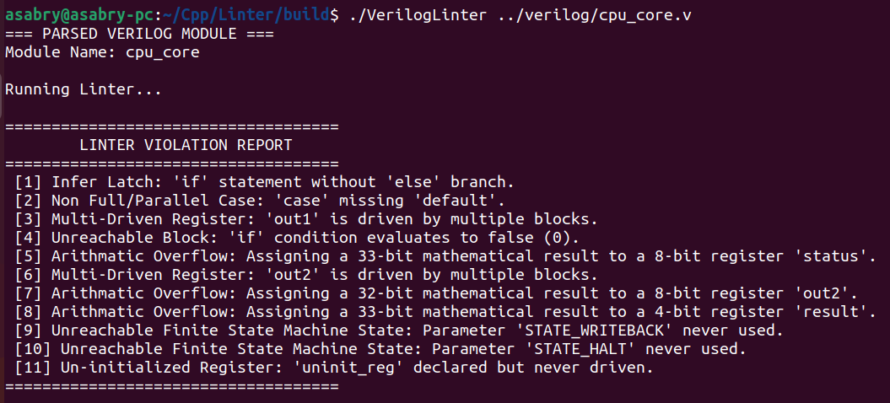
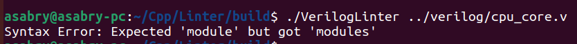

# 🧠 Modern C++ Verilog Static Analyzer

A lightweight **Verilog parser and static linter** built in **C++17**, demonstrating compiler-style EDA toolchain design: zero-copy lexing, parsing, arena-based AST construction, and static semantic analysis — with no external dependencies.

---

## 📑 Table of Contents

1. [Architecture](#architecture)
2. [Lint Checks](#lint-checks)
3. [Performance](#performance)
4. [Modern C++ Design](#modern-c-design)
5. [Build & Run](#build--run)
6. [Limitations](#limitations)

---

## Architecture

The pipeline has three stages, each designed around allocation efficiency and zero-copy data flow:

**Lexer** — Zero-copy tokenization via `std::string_view`. Manual character classification (no regex), no heap allocation during the lex pass. Handles identifiers, keywords, Verilog number literals (`8'hFF`), and `//` / `/* */` comments.

**Parser** — Recursive-descent parser that builds an AST entirely within a PMR monotonic arena. Nodes are represented with `std::variant`. Supports modules, parameters, ports, `always` blocks, non-blocking assignments, `if/else`, and `case` statements.

**Linter** — Semantic and structural analysis pass over the AST, performing constant folding and bit-width propagation to power the checks below.

---

## Lint Checks

- Multi-driven registers
- Bit-width mismatches and overflow
- Latch inference
- Missing `default` in `case`
- Uninitialized registers
- Unreachable FSM states
- Constant expression evaluation

---

## Performance

Benchmarked on a **700K-line, 25 MB** Verilog file with [`hyperfine`](https://github.com/sharkdp/hyperfine) (10 warm-up runs):


| Metric | Result |
|--------|--------|
| Mean | **658.4 ms ± 5.9 ms** |
| Min / Max | 650.3 ms / 669.6 ms |

Performance is driven by two architectural decisions: **PMR arena allocation** eliminates per-node `malloc` overhead throughout the parse phase, and the **zero-copy lexer** avoids any string materialization — tokens are `string_view` slices into the original source buffer. The result is that nearly all runtime is I/O and process startup; the analysis itself is negligible.

---

## Output Example:
using the input verilog code:
```v
module cpu_core #(
    parameter STATE_FETCH     = 0,
    parameter STATE_DECODE    = 1,
    parameter STATE_EXECUTE   = 2,
    parameter STATE_MEMORY    = 3,
    parameter STATE_WRITEBACK = 4,
    parameter STATE_HALT      = 5
)(
    input            clk,
    input            rst,
    input      [7:0] data,
    output reg [7:0] out1,    // 8-bit: avoids spurious overflow on normal assigns
    output reg [7:0] out2,    // 8-bit: same
    output reg [7:0] status,  // 8-bit: same
    output reg [3:0] result,  // 4-bit: triggers overflow only where intended
    output reg       uninit_reg
);
    reg [2:0] state;
    reg [7:0] prev_state;

    // =====================
    // BLOCK 1: Combinational logic
    // VIOLATION 1 → Infer Latch:        'if' without 'else' for out1
    // VIOLATION 2 → Non-Full Case:      'case' missing 'default'
    // VIOLATION 3,4 → Unreachable FSM:  STATE_HALT, STATE_WRITEBACK never used
    // =====================
    always @(*) begin
        if (data == 8'h01)
            out1 <= 8'hAA;           // no else → latch on out1

        case (state)
            STATE_FETCH:   out2 <= 8'h00;
            STATE_DECODE:  out2 <= 8'h01;
            STATE_EXECUTE: out2 <= 8'h02;
            STATE_MEMORY:  out2 <= 8'h03;
            // STATE_WRITEBACK and STATE_HALT intentionally omitted
            // no default → non-full case
        endcase
    end

    // =====================
    // BLOCK 2: Clocked logic
    // VIOLATION 5 → Multi-Driven:       out1 also driven in BLOCK 1
    // VIOLATION 6 → Arithmetic Overflow: 8'hFF + 1 is 9-bit, assigned to 8-bit status
    // VIOLATION 7 → Unreachable Block:  if(0) branch
    // =====================
    always @(posedge clk) begin
        out1 <= data;                   // multi-driven (BLOCK 1 also drives out1)

        if (0) begin                    // unreachable block
            status <= 8'h00;
        end else begin
            status <= 8'hFF + 1;        // 9-bit result → 8-bit reg: overflow
        end
    end

    // =====================
    // BLOCK 3: Clocked logic
    // VIOLATION 8 → Multi-Driven:       out2 also driven in BLOCK 1
    // VIOLATION 9 → Arithmetic Overflow: prev_state(8) + data(8) = 9-bit → 4-bit result
    // =====================
    always @(posedge clk) begin
        if (rst) begin
            out2   <= 8'h00;
            result <= 4'h0;
        end else begin
            out2   <= prev_state;               // multi-driven (BLOCK 1 also drives out2)
            result <= prev_state + data;        // 9-bit sum → 4-bit result: overflow
        end
    end

    // uninit_reg intentionally never driven
    // VIOLATION 10 → Uninitialized Register: 'uninit_reg'

endmodule

```
### Output of the Linter:


### Another example (Syntax Error:)

## Modern C++ Design

| Area | Technique | Effect |
|------|-----------|--------|
| **Zero-copy lexing** | `std::string_view` throughout the token stream | No heap allocation during tokenization; tokens are slices into the source buffer |
| **Arena allocation** | `std::pmr::monotonic_buffer_resource` + `std::pmr::polymorphic_allocator` | Eliminates per-node `malloc`; sequential bump allocation improves cache locality |
| **Type-safe AST nodes** | `std::variant` + `std::visit` | Stack-allocated tagged union; avoids vtable dispatch and pointer indirection |
| **Fast number parsing** | `std::from_chars` (no locale, no allocation) | Faster than `stoi`/`strtol`; no locale lookup, no string copy |
| **Null safety** | `std::optional` for fallible lookups | Zero overhead vs. raw pointer; communicates absence without heap allocation |
| **Scoped enumerations** | `enum class` for token and node kinds | No implicit conversion overhead; compiler-enforced type safety at zero runtime cost |

---

## Build & Run

```bash
mkdir build && cd build
cmake ..
make

./VerilogLinter file.v
```

---

## Limitations

This tool targets a practical subset of Verilog, not the full IEEE spec:

- Operators limited to `+`, `-`, `==`
- No blocking assignments (`=`), generate blocks, or hierarchical modules
- No elaboration phase
- Simplified error handling (`exit(1)`)