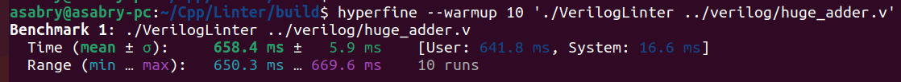
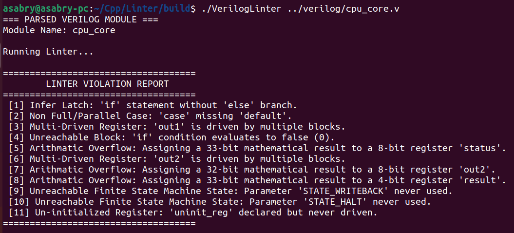
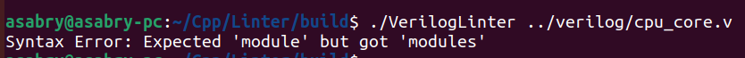

# 🧠 Modern C++ Verilog Static Analyzer

A lightweight **Verilog parser and static linter** built in **C++17**, demonstrating compiler-style EDA toolchain design: zero-copy lexing, recursive-descent parsing with correct operator precedence, arena-based AST construction, static semantic analysis, and JSON AST export — with minimal external dependencies.

---

## 📑 Table of Contents

1. [Architecture](#architecture)
2. [Lint Checks](#lint-checks)
3. [Performance](#performance)
4. [Modern C++ Design](#modern-c-design)
5. [JSON AST Export](#json-ast-export)
6. [Build & Run](#build--run)
7. [Limitations](#limitations)

---

## Architecture

The pipeline has three stages, each designed around allocation efficiency and zero-copy data flow:

**Lexer** — Zero-copy tokenization via `std::string_view`. Manual character classification (no regex), no heap allocation during the lex pass. Handles identifiers, keywords, Verilog number literals (`8'hFF`), `//` / `/* */` comments, and advanced multi-character operators such as `<<`, `&&`, and `>=`.

**Parser** — Recursive-descent parser that builds an AST entirely within a PMR monotonic arena. Nodes are represented with `std::variant`. Operator precedence is handled correctly via recursive descent (no flat expression parsing). Supports modules, parameters, ports, internal `wire`/`reg` declarations, continuous `assign` statements, `always` blocks, both blocking (`=`) and non-blocking (`<=`) assignments, `if/else`, and `case` statements.

**Linter** — Semantic and structural analysis pass over the AST, performing constant folding and bit-width propagation to power the checks below. Now validates blocking vs. non-blocking assignment contexts and catches width mismatches across `assign` statements and internal declarations.

---

## Lint Checks

- Multi-driven registers
- Bit-width mismatches and overflow (including in `assign` statements)
- Latch inference
- Missing `default` in `case`
- Uninitialized registers
- Unreachable FSM states
- Constant expression evaluation
- Blocking assignment (`=`) used in clocked (`always @(posedge/negedge)`) contexts
- Non-blocking assignment (`<=`) used in combinational (`always @(*)`) contexts

---

## Performance

Benchmarked on a **700K-line, 25 MB** Verilog file with [`hyperfine`](https://github.com/sharkdp/hyperfine) (10 warm-up runs):


| Metric | Result |
|--------|--------|
| Mean | **658.4 ms ± 5.9 ms** |
| Min / Max | 650.3 ms / 669.6 ms |

Performance is driven by two architectural decisions: **PMR arena allocation** eliminates per-node `malloc` overhead throughout the parse phase, and the **zero-copy lexer** avoids any string materialization — tokens are `string_view` slices into the original source buffer. The result is that nearly all runtime is I/O and process startup; the analysis itself is negligible.

---

## Output Example

Using the input Verilog code:
````v
module cpu_core #(
    parameter STATE_FETCH     = 0,
    parameter STATE_DECODE    = 1,
    parameter STATE_EXECUTE   = 2,
    parameter STATE_MEMORY    = 3,
    parameter STATE_WRITEBACK = 4,
    parameter STATE_HALT      = 5
)(
    input            clk,
    input            rst,
    input      [7:0] data,
    output reg [7:0] out1,
    output reg [7:0] out2,
    output reg [7:0] status,
    output reg [3:0] result,
    output reg       uninit_reg
);
    reg [2:0] state;
    reg [7:0] prev_state;

    always @(*) begin
        if (data == 8'h01)
            out1 <= 8'hAA;           // no else → latch on out1
        case (state)
            STATE_FETCH:   out2 <= 8'h00;
            STATE_DECODE:  out2 <= 8'h01;
            STATE_EXECUTE: out2 <= 8'h02;
            STATE_MEMORY:  out2 <= 8'h03;
        endcase
    end

    always @(posedge clk) begin
        out1 <= data;
        if (0) begin
            status <= 8'h00;
        end else begin
            status <= 8'hFF + 1;
        end
    end

    always @(posedge clk) begin
        if (rst) begin
            out2   <= 8'h00;
            result <= 4'h0;
        end else begin
            out2   <= prev_state;
            result <= prev_state + data;
        end
    end

endmodule
````

### Output of the Linter:


### Syntax Error Example:


---

## Modern C++ Design

| Area | Technique | Effect |
|------|-----------|--------|
| **Zero-copy lexing** | `std::string_view` throughout the token stream | No heap allocation during tokenization; tokens are slices into the source buffer |
| **Arena allocation** | `std::pmr::monotonic_buffer_resource` + `std::pmr::polymorphic_allocator` | Eliminates per-node `malloc`; sequential bump allocation improves cache locality |
| **Type-safe AST nodes** | `std::variant` + `std::visit` | Stack-allocated tagged union; avoids vtable dispatch and pointer indirection |
| **Operator precedence** | Recursive-descent expression grammar | Correct mathematical precedence without a separate precedence-climbing pass |
| **Fast number parsing** | `std::from_chars` (no locale, no allocation) | Faster than `stoi`/`strtol`; no locale lookup, no string copy |
| **Null safety** | `std::optional` for fallible lookups | Zero overhead vs. raw pointer; communicates absence without heap allocation |
| **Scoped enumerations** | `enum class` for token and node kinds | No implicit conversion overhead; compiler-enforced type safety at zero runtime cost |

---

## JSON AST Export

The linter now supports exporting the full AST to a JSON file via [nlohmann/json](https://github.com/nlohmann/json). This makes it straightforward to integrate downstream tooling, build custom analysis passes, or inspect parse results programmatically.
````bash
./VerilogLinter file.v --export-ast ast.json
````

Each AST node is serialized with its kind, source location, and child relationships. The JSON output is self-contained and suitable for consumption by external scripts, IDEs, or visualization tools.

---

## Build & Run
````bash
mkdir build && cd build
cmake ..
make

# Run the linter
./VerilogLinter <verilog_file.v>

# Run the linter and export the AST to JSON
./VerilogLinter <verilog_file.v> [--export-ast <output.json>]

````

---

## Limitations

This tool targets a practical subset of Verilog, not the full IEEE spec:

- Operators limited to `+`, `-`, `==`, `<<`, `>>`, `&&`, `||`, `>=`, `<=`, and related multi-character forms
- No generate blocks or hierarchical modules
- No elaboration phase
- Simplified error handling (`exit(1)`)